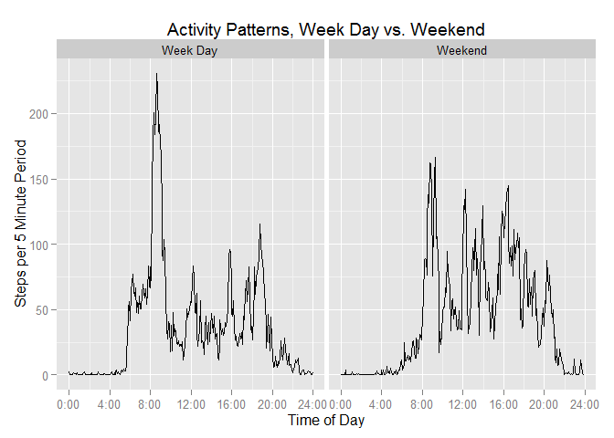

# Reproducible Research: Peer Assessment 1


## Part I: Loading and preprocessing the data


###1. Load the data

```r
setwd("~/School Related Documents/Coursera/datascience/Reproducible Research/Assignment1")

activity <- read.csv("activity/activity.csv")
```


###2. Process interval data to create time variable


```r
activity$hour <- trunc(activity$interval/100)
activity$minute <- activity$interval - 100*activity$hour

activity$minute[activity$minute < 9] <- 
        paste("0", activity$minute[activity$minute < 9], sep = "")

activity$time <- paste(activity$hour, activity$minute, "00", sep = ":")
```

Convert new time variable to "times" class using the chron package


```r
library(chron)
activity$time <- chron(times. = activity$time)
```


***


## Part II: What is mean total number of steps taken per day?


### 1.  Calculate total number of steps taken per day

I interpret this to mean calculate the total number of steps taken each day. I have produced a table summarizing this, and print the first 6 rows of that table below. I created this summary using the dplyr package.


```r
library(dplyr)
perday <- activity %>% group_by(date) %>% summarize(steps = sum(steps, na.rm=T))

head(perday)
```

```
## Source: local data frame [6 x 2]
## 
##         date steps
##       (fctr) (int)
## 1 2012-10-01     0
## 2 2012-10-02   126
## 3 2012-10-03 11352
## 4 2012-10-04 12116
## 5 2012-10-05 13294
## 6 2012-10-06 15420
```


### 2. Plot a histogram of the number of steps taken per day


```r
hist(perday$steps, xlab = "Number of Steps", ylab = "Number of Days", main = "Histogram of Steps per Day")
```

 


### 3. What is the mean and median number of steps taken per day?

Mean:

```r
mean(perday$steps)
```

```
## [1] 9354.23
```

Median:

```r
median(perday$steps)
```

```
## [1] 10395
```


***


## Part III: What is the average daily activity pattern?


###1. Chart mean activity by time period

Create data frame giving the mean activity for each time period using the dplyr package


```r
perperiod <- activity %>% group_by(time) %>% summarise(msteps = mean(steps, na.rm=T))
```

Chart the data


```r
with(perperiod, plot(time, msteps, type = "l", ylab = "Mean Number of Steps", xaxt="n"))
title(main = "Mean Number of Steps per 5 Minute Interval")
axis(1, at = 0:6/6, labels = paste(4*0:6, "00", sep=":"))
```

 

###2. Report time period with most activity


```r
perperiod$time[perperiod$msteps == max(perperiod$msteps)]
```

```
## [1] 08:35:00
```


***


## Part IV: Imputing missing values


###1. Calculate number of rows with missing steps data:


```r
nrow(activity[is.na(activity$steps),])
```

```
## [1] 2304
```


###2. Develop a strategy for filling in missing data:

I will insert the mean of each time period when data is missing.


###3. Create New Data Set With Missing Data Imputed

A. Copy activity data set
B. If steps variable is NA, insert mean number of steps from the perperiod data frame created for the analysis of the daily activity pattern.


```r
activity2 <- activity

for(i in 1:nrow(perperiod)){
    activity2$steps[is.na(activity2$steps) & activity2$time == perperiod$time[i]] <- perperiod$msteps[i]
}
```


###4. Make a histogram of total daily activity and report the mean and median number of steps.

Create table of total daily activity


```r
perday2 <- activity2 %>% group_by(date) %>% summarize(steps = sum(steps, na.rm=T))

head(perday)
```

```
## Source: local data frame [6 x 2]
## 
##         date steps
##       (fctr) (int)
## 1 2012-10-01     0
## 2 2012-10-02   126
## 3 2012-10-03 11352
## 4 2012-10-04 12116
## 5 2012-10-05 13294
## 6 2012-10-06 15420
```

Show histogram of daily activity with missing values imputed


```r
hist(perday2$steps, xlab = "Number of Steps", ylab = "Number of Days", main = "Histogram of Steps per Day, 
Missing Values Imputed")
```

 

Show Mean and Median and differences between originals and values with missing values imputed.

Mean:

```r
mean(perday2$steps)
```

```
## [1] 10766.19
```

Difference in means:


```r
mean(perday2$steps)- mean(perday$steps)
```

```
## [1] 1411.959
```

The mean number of steps with missing values imputed is 1411.959171 greater than without the imputed values.

Median:

```r
median(perday2$steps)
```

```
## [1] 10766.19
```

Difference in medians:

```r
median(perday2$steps) - median(perday$steps)
```

```
## [1] 371.1887
```

The median number of steps with missing values imputed is 371.1886792 greater than without the imputed values.


***


## Part V: Are there differences in activity patterns between weekdays and weekends?


###1. Create new fields to compare week days to weekends

Create fields denoting the day of the week and showing whether the day is a week day or weekend. Use the activity2 data frame, which includes imputed values, for this analysis.


```r
activity2$day <- weekdays(as.Date(activity2$date), abbreviate = T)
activity2$weekend[activity2$day %in% c("Sat", "Sun")] <- "Weekend"
activity2$weekend[activity2$day %in% c("Mon", "Tue", "Wed", "Thu", "Fri")] <- "Week Day"
activity2$weekend <- as.character(activity2$weekend)
```


###2. Plot activity per period, comparing week days to weekends

Create Data Set giving the per period averages for week days and weekends


```r
perperiod2 <- activity2 %>% group_by(weekend, time) %>% summarise(msteps = mean(steps, na.rm=T))
```


Plot per period activity using the ggplot2 package


```r
library(ggplot2)

plot_perperiod <- ggplot(data = perperiod2, aes(x=time, y=msteps)) + geom_line() 
plot_perperiod <- plot_perperiod + scale_x_continuous(breaks = 0:6/6, labels = paste(4*0:6, "00", sep=":"))
plot_perperiod <- plot_perperiod + ggtitle("Activity Patterns, Week Day vs. Weekend") +
                                   ylab("Steps per 5 Minute Period") +
                                   xlab("Time of Day")
plot_perperiod <- plot_perperiod + facet_grid( .~ weekend)

plot_perperiod
```

 
